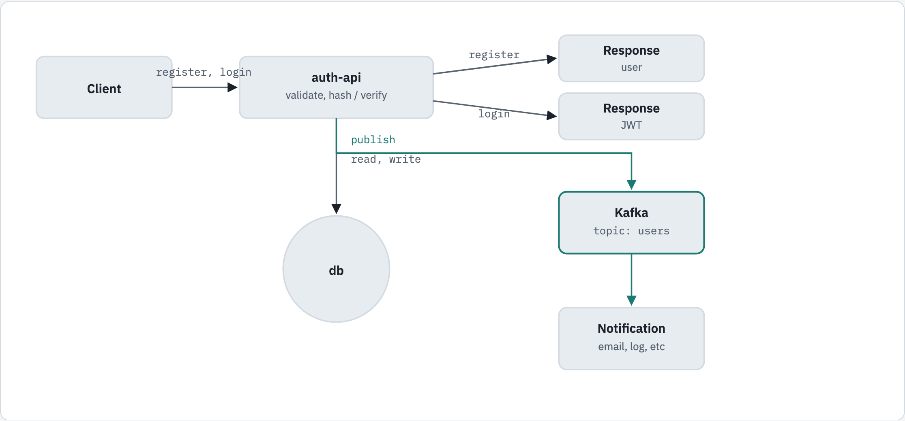
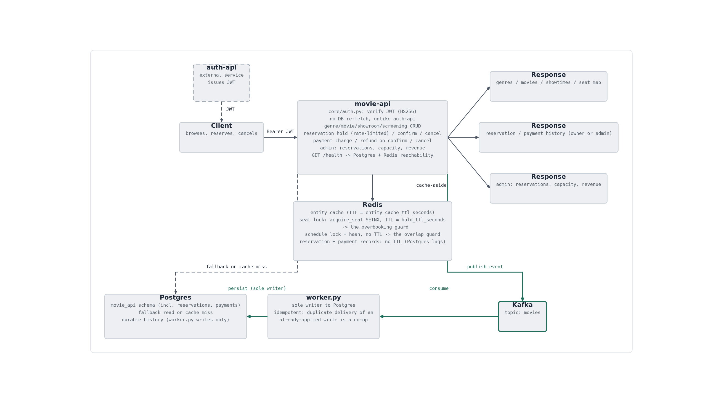
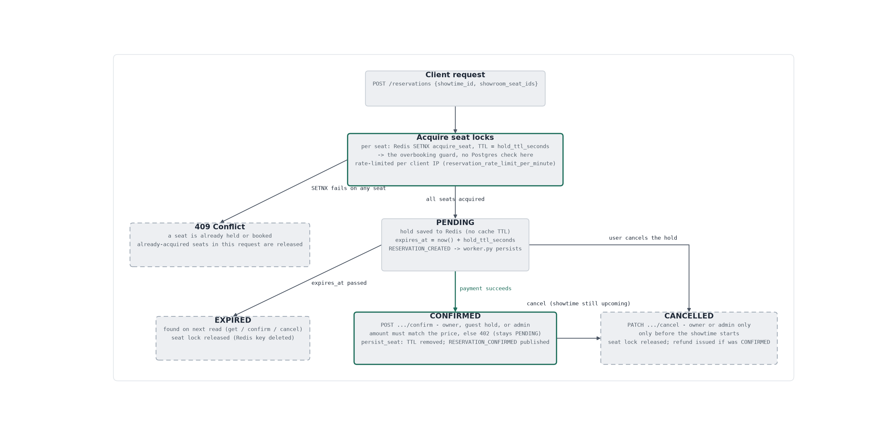

# Movie Reservation System

[](https://github.com/oscaroguledo/Movie-Reservation-System-2/actions/workflows/ci.yml)

A Java / Spring Boot backend for a movie reservation service, ported 1:1
from the Python/FastAPI reference implementation at
[oscaroguledo/Movie-Reservation-System](https://github.com/oscaroguledo/Movie-Reservation-System).
The goal of the port is **architectural parity, not a simplified
rewrite** — the same two-service topology, the same eventually-consistent
write pipeline, and the same Redis-as-concurrency-guard patterns as the
original, re-expressed idiomatically in Java.

## Table of contents

- [Status](#status)
- [Architecture](#architecture)
  - [Write pipeline](#write-pipeline)
  - [auth-api](#auth-api)
  - [movie-api](#movie-api)
  - [Reservation lifecycle](#reservation-lifecycle)
- [Tech stack](#tech-stack)
- [Project structure](#project-structure)
- [Getting started](#getting-started)
- [API reference](#api-reference)
- [Testing](#testing)
- [Notable design decisions](#notable-design-decisions)

## Status

| Service      | Status      | Covers                                                                 |
|--------------|-------------|-------------------------------------------------------------------------|
| `auth-api`   | Complete    | Accounts, JWT auth with server-side revocation, role-based access, rate limiting |
| `movie-api`  | Complete    | Catalog, screening scheduling, seat-hold reservations, simulated payments, admin reporting |

Both services share one Postgres instance, one Redis instance, and one
Kafka broker, each running as its own container behind `docker-compose.yml`.

## Architecture

### Write pipeline

Both services write through the same cache-aside + event-sourcing
pipeline:

1. A write lands in **Redis** immediately, so an immediate read reflects
   it (read-your-writes) even before Postgres has seen it.
2. The same write is published as a domain event to **Kafka**.
3. An async worker (`AuthEventWorker` / `MovieEventWorker` — a
   `@KafkaListener` running in-process, not a separate deployable)
   consumes the event and persists it to **Postgres**, the system of
   record. Redis is a cache that can always be rebuilt from Postgres.

This is deliberately **eventually consistent**, matching the Python
reference exactly, including its accepted races (e.g. a delete processed
before the register event that created the row). `movie-api`'s worker
additionally replicates the reference's more defensive semantics: a
duplicate `CREATE` (redelivery) is treated as a no-op, an `UPDATE`
arriving before its `CREATE` falls back to creating the row, and only a
database-unavailable failure leaves a Kafka message unacknowledged.

Unlike the Python reference's standalone `worker.py` process, both
services' Kafka consumers run in-process alongside the web server. One
container serves HTTP and consumes events on separate threads. Splitting
either out into its own deployable later is a small change — a
`web-application-type: none` Spring profile pointed at the same consumer
group — without touching any event-handling code.

### auth-api



`auth-api` owns accounts and JWT issuance. `register`/`login` validate
and hash/verify credentials, write through to Postgres via the pipeline
above, and publish onto the `users` Kafka topic for downstream consumers
(notifications, audit logging, etc. in the original design).

### movie-api



`movie-api` verifies the JWTs `auth-api` issues (same shared secret, no
network call back to `auth-api`) and owns the catalog, screenings,
reservations, and payments. It has no access to `auth-api`'s revocation
table, so it does **not** check token revocation — a real, acknowledged
limitation in the reference that is replicated as-is rather than "fixed."

Redis plays two roles here, and it's worth being precise about which is
which:

- **Cache-aside**, for simple entities (genres, movies, showrooms, seats)
  — a TTL-bound read-through/write-through cache in front of Postgres,
  same pattern as `auth-api`'s `User`.
- **The actual concurrency guard**, for the two places where correctness
  depends on atomicity, not just speed:
  - **Seat holds**: `SET key value NX PX <hold_ttl>` (Spring:
    `opsForValue().setIfAbsent(...)`) keyed by `showtime:seat`. This
    atomic operation — not a Postgres unique index — is what prevents two
    clients from booking the same seat. The unique index is a backstop,
    not the live guard.
  - **Screening overlap**: a short-lived `SETNX` lock around a
    check-then-append against the showroom's cached schedule, preventing
    two screenings from double-booking a showroom.

A `PENDING` reservation is lazily settled to `EXPIRED` on read once its
hold TTL has passed — there is no background sweep. Guests are
first-class: no bearer token still resolves to a guest principal, not a
401, and a guest's reservation id is its only credential. Payments are
simulated — `confirm` succeeds only if the submitted amount exactly
matches the screening price, otherwise it's recorded `FAILED` and the
call returns `402`; cancelling a `CONFIRMED` reservation auto-refunds.

### Reservation lifecycle



## Tech stack

- **Java 21**, **Spring Boot 3.2**, Gradle multi-module build
- **Postgres 16** + Flyway (schema is the system of record)
- **Redis 7** (cache-aside + the seat-lock/overlap concurrency guards above)
- **Kafka 3.8** (KRaft mode, no ZooKeeper)
- **Spring Security** + JWT (`io.jsonwebtoken`), Argon2id password hashing
  (`Argon2PasswordEncoder`) in `auth-api`
- **Testcontainers** + JUnit 5 + AssertJ + Mockito + Awaitility for
  integration tests against real Postgres/Redis/Kafka containers

## Project structure

```
settings.gradle, build.gradle    # multi-module root — shared plugin/Java config
docker-compose.yml                # postgres, redis, kafka, auth-api, movie-api
.env.example
docs/diagrams/                    # architecture diagrams used in this README

auth-api/
  Dockerfile
  build.gradle
  src/main/java/auth/
    Application.java
    config/       # Security, Redis, JPA/Flyway wiring
    controller/   # AuthController, UserController, HealthController
    dto/          # request/response records
    event/        # AuthEvent + subtypes, publisher, Kafka worker
    cache/        # Redis cache-aside helpers
    model/        # User, RevokedToken, UserType
    ratelimit/    # Redis sliding-window rate limiter + filter
    repository/   # Spring Data JPA repositories
    security/     # JwtProvider, JwtAuthenticationFilter, AuthPrincipal
    service/      # UserService, TokenService
    web/          # exceptions + GlobalExceptionHandler
  src/main/resources/
    application.yml
    db/migration/ # Flyway SQL, mirrors the Python schema.dbml
  src/test/java/auth/  # unit + Testcontainers integration tests

movie-api/
  Dockerfile
  build.gradle
  src/main/java/movie/
    Application.java
    config/       # Redis, JPA/Flyway, Security wiring
    controller/   # Genre/Movie/Showroom/Screening/Reservation/Payment/
                   # AdminReport/HealthController
    dto/          # request/response records
    event/        # MovieEvent + subtypes, publisher, Kafka worker
    cache/        # EntityCacheService, SeatLockService, ScreeningCacheService,
                   # ReservationCacheService
    model/        # Genre, Movie, Showroom, ShowroomSeat, Showtime,
                   # MovieShowtime, Reservation, Payment, + status enums
    ratelimit/    # Redis sliding-window rate limiter (POST /reservations only)
    repository/   # Spring Data JPA repositories
    security/     # MoviePrincipal, JwtPrincipalFilter (guest-by-default,
                   # no revocation check)
    service/      # Genre/Movie/Showroom/Screening/Reservation/Payment/
                   # ReportingService
    web/          # exceptions + GlobalExceptionHandler
  src/main/resources/
    application.yml
    db/migration/ # Flyway SQL, mirrors the Python schema.dbml
  src/test/java/movie/  # unit + Testcontainers integration tests
```

## Getting started

### Docker Compose (recommended)

```bash
cp .env.example .env
# edit .env — at minimum set a real JWT_SECRET_KEY (32+ bytes)
docker compose up -d --build

curl http://localhost:8010/health   # auth-api
curl http://localhost:8011/health   # movie-api
```

| Service    | URL                     |
|------------|--------------------------|
| `auth-api` | http://localhost:8010   |
| `movie-api`| http://localhost:8011   |
| Redis      | localhost:6380           |

Ports are deliberately non-default (not `8000`/`8001`/`6379`) so this
stack can run alongside the Python reference's own `docker-compose` on
the same machine without a clash. Both services share one Postgres
database, with `auth_api`/`movie_api` as separate schemas within it —
matching the Python reference's own shape rather than provisioning two
databases.

### Local development (no Docker for the app itself)

```bash
./gradlew :auth-api:bootRun   # or :movie-api:bootRun
```

Needs Postgres/Redis/Kafka reachable at the hosts/ports in each module's
`application.yml` defaults (`localhost`), or override via environment
variables (`DB_HOST`, `REDIS_HOST`, `KAFKA_BOOTSTRAP_SERVERS`, etc. — see
each module's `application.yml` and `.env.example`).

## API reference

### auth-api (`:8010`)

| Method | Path                    | Auth                 | Notes                          |
|--------|--------------------------|-----------------------|----------------------------------|
| GET    | `/health`                | none                   |                                  |
| POST   | `/auth/register`         | none (rate-limited)    | always creates a `REGULAR` user |
| POST   | `/auth/register/admin`   | ADMIN                  | the only way to grant admin     |
| POST   | `/auth/login`            | none (rate-limited)    | returns a JWT access token      |
| POST   | `/auth/logout`           | bearer token           | revokes the caller's own token  |
| GET    | `/users/me`              | bearer token           |                                  |
| GET    | `/users`                 | ADMIN                  | filter by `type`, paginate      |
| GET    | `/users/{id}`            | bearer token           | self or ADMIN                   |
| PATCH  | `/users/{id}`            | bearer token           | self or ADMIN                   |
| DELETE | `/users/{id}`            | bearer token           | self or ADMIN                   |

### movie-api (`:8011`)

| Method                 | Path                                                        | Auth                          | Notes                              |
|------------------------|---------------------------------------------------------------|--------------------------------|--------------------------------------|
| GET                    | `/health`                                                      | none                            |                                      |
| POST / GET / PATCH / DELETE | `/genres`, `/genres/{id}`                                | writes: ADMIN · reads: none    | full CRUD                           |
| POST / GET / PATCH / DELETE | `/movies`, `/movies/{id}`                                | writes: ADMIN · reads: none    | includes genre association          |
| POST / GET / PATCH / DELETE | `/showrooms`, `/showrooms/{id}`                          | writes: ADMIN · reads: none    |                                      |
| POST                   | `/showrooms/{id}/seats`                                        | ADMIN                           | bulk-create rows × seats-per-row    |
| GET                    | `/showrooms/{id}/seats`                                        | none                             |                                      |
| POST                   | `/screenings`                                                   | ADMIN                           | Redis-locked overlap check → 409    |
| GET                    | `/screenings`                                                   | none                             | by date or upcoming                 |
| DELETE                 | `/screenings/{movieId}/{showroomId}/{showtimeId}`               | ADMIN                           | refused if reservations exist       |
| GET                    | `/screenings/{movieId}/{showroomId}/{showtimeId}/seats`         | none                             | seat map: available / held / booked |
| POST                   | `/reservations`                                                 | none (guests allowed, rate-limited) | all-or-nothing multi-seat hold  |
| GET                    | `/reservations`                                                 | bearer token (not guest)        | caller's own reservations           |
| GET                    | `/reservations/{id}`                                            | none                             | lazily settles to `EXPIRED` if past TTL |
| POST                   | `/reservations/{id}/confirm`                                     | none                             | simulated payment; `402` on amount mismatch |
| PATCH                  | `/reservations/{id}/cancel`                                      | none                             | auto-refunds if `CONFIRMED`         |
| GET                    | `/reservations/{id}/payments`                                    | none                             |                                      |
| GET                    | `/admin/reservations`                                            | ADMIN                            | filter by status, paginate          |
| GET                    | `/admin/screenings/{movieId}/{showroomId}/{showtimeId}/capacity` | ADMIN                            |                                      |
| GET                    | `/admin/revenue`                                                  | ADMIN                            | gross / refunded / net              |

## Testing

```bash
./gradlew clean build
```

Runs the full unit + Testcontainers integration suite for both modules;
Postgres, Redis, and Kafka containers are started automatically
(requires Docker).

Both modules have also been exercised manually against the real
`docker compose up` stack, not just the automated suite — end to end:
register → login, full catalog CRUD, schedule a screening → hold seats →
double-booking rejected with `409` → confirm with payment →
cancel-and-refund → admin report, all verified against the running
containers.

## Notable design decisions

- **In-process workers, not separate deployables.** The Python
  reference runs `worker.py` as its own process; here, `AuthEventWorker`
  and `MovieEventWorker` are `@KafkaListener` beans in the same Spring
  application as the web server. Same asynchronous effect, one fewer
  container to operate for a project this size — see
  [Write pipeline](#write-pipeline) above for the trade-off and how to
  split it out later if needed.
- **Application-assigned UUIDs**, not database-generated ones. Every
  entity that goes through the Redis-write-first pipeline needs its
  final id before Postgres is ever involved, so ids are assigned in the
  application (`UUID.randomUUID()`), not by the database.
- **Enums as `VARCHAR` + `CHECK`**, not native Postgres enum types —
  avoids Hibernate/JDBC enum-mapping brittleness across schema changes.
- **No revocation check in `movie-api`.** It validates `auth-api`'s JWTs
  with the shared secret but has no access to the revocation table. This
  mirrors a real, acknowledged gap in the Python reference rather than
  "fixing" it — the two services intentionally stay decoupled at the
  data layer.
